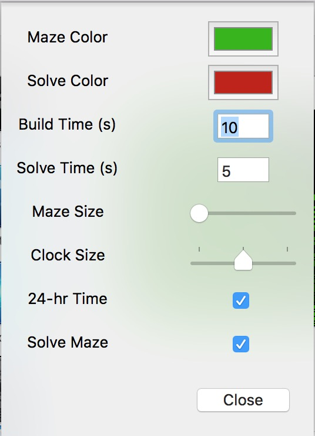

# ScreenMazer

ScreenMazer is a screensaver for Mac that builds a maze, and then solves it, repetitively.  I had this idea a while back watching some gifs of maze generation, and so I made it!

  <video src="sampleMaze.mov" height="100" > 
  <i>Video of it in action</i>

   
  <i>Settings Page</i>

## Installation:
1. Download from [this link]() and double click to add it to Settings.  Then customize it!

Alternatively, you can build it from the source here.

### With Help From
* [ScreenSaverMinimal](https://github.com/mirkofetter/ScreenSaverMinimal)
* [ColorClockSaver](https://github.com/edwardloveall/ColorClockSaver)
* [maze-generation-algorithms](https://github.com/lucas-tulio/maze-generation-algorithms)